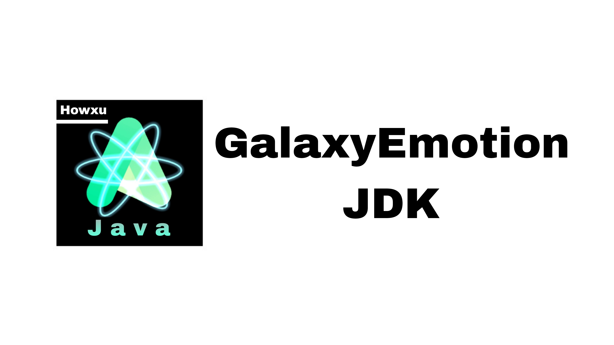

# Galaxy Emotion


  

**GalaxyEmotion** is based on the dragonwell project and uses Bellsoft Liberica JDK source code for deep refactoring optimized JDK, more than 30 percent performance optimization and support for both Linux and Windows platforms.  

## How to get JRE
After JDK8，the JDK source make doesn't provide JRE images , you can get it by :

```baah
jlink.exe --module-path jmods --add-modules java.desktop --output jre
```
JRE will be exported in the./jre folder.

 ## IDEA doesn't work
IDEA may not work well for some vendor problem or version problem . It will be solved in the future .  

If you want to use GalaxyEmotion in your IDEA , please replace the **rt.jar** file somewhere in the JDK install path with the same rt.jar file of Bellsoft Liberica JDK.  

Complier: Howxu  
email: <howxu366@outlook.com>
